<h1 align="center">Hi, I'm Arooba 👋</h1>
<h3 align="center">Data Analyst who thinks a slow query is a personal insult</h3>

I take messy tables and make them fast, honest, and occasionally beautiful. Currently open to work, currently arguing with PostgreSQL about indexes.

  
  

 

## 📊 The receipts

       

> One query I'm proud of: turned a full 500k-row table scan into an indexed lookup, **49.253ms → 0.155ms**. Benchmarked query performance on a 100k-order dataset and optimized access to the foreign-key columns everyone actually filters on.

 

## 🛠️ What I actually use

  
  
  
  
  
  

 

## 🎓 Currently leveling up

  
  

 

## 🚀 Featured build

### [E-Commerce Database & Analytics System](https://github.com/Aroobs-i/E-Commerce_Database_And_Analytics_System)

A PostgreSQL e-commerce database and analytics system built to actually prove the fundamentals: relational design, SQL analytics, query optimization, indexing, and performance testing under real load. This is where the 317x number above came from, not a slide.

 

  

